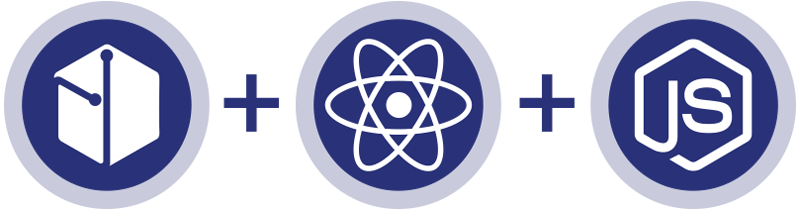

<p align="left">

</img>
</p>


# Devery React + Node.js boilerplate

## Running server

<p align="left">

</img>
</p>


### This application is using MongoDB. Be sure you have it. You can run it with Docker for development.
```
docker run --name name -p 27017:27017 -d mongo
```
<span><a href="https://www.mongodb.com/cloud/atlas/lp/general/try?utm_source=google&utm_campaign=gs_emea_ukraine_search_brand_atlas_desktop&utm_term=mongodb&utm_medium=cpc_paid_search&utm_ad=e&gclid=CjwKCAjwvOHzBRBoEiwA48i6Ait4K8tfTrSdMXKEWiMDrgCtG5FQe-yytqNk-rx2ddQerJQjWojU6xoCbiUQAvD_BwE"></a></span>
<span><a href="https://www.docker.com/"></a></span>

### Also you will need SendGrid account for creating registration confirming mails.
</br>
<p align="left">

</img>
</p>

1) `cd ./server`
2) Type `npm install` or `yarn`
3) Copy `.env.example` to `.env` file and fill it
4) set FORCE_BOOTSTRAP_DATA -> `true` to seed database for a first(!) run
5) run `npm run dev` or `yarn dev`

<span><a href="https://sendgrid.com/marketing/sendgrid-services-cro/?extProvId=5&extPu=49397-gaw&extLi=164417502&sem_adg=8807286342&extCr=8807286342-321630592685&extSi=&extTg=&keyword=sendgrid&extAP=&extMT=e&utm_medium=cpc&utm_source=google&gclid=CjwKCAjwvOHzBRBoEiwA48i6AkZumm0cFLBE2AVO1J-9SrakxB6whSVjb1e4KS0J_LpnCL-_0U-rhBoCzxkQAvD_BwE"></a></span>


## Running client

1) `cd ./client`
2) Change ip address of server in `utilities/sdk/index.js`
3) Run `npm install` or `yarn`
4) Run development server using `npm start` or `yarn start`
5) open `localhost:1234` in a browser

In case you want to build this repository use `npm run build` or `yarn build`

<span><a href="https://github.com/devery/node_boilerplate"></a></span>
<span><a href="https://github.com/devery/eveplate"></a></span>
<span><a href="https://github.com/devery/deveryjs"></a></span>
